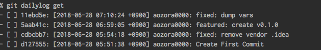

# git-dailylog

commit log to dailylog

## Description



## Usage

```console
$ git dailylog init                         //create .dailylog format file
$ git dailylog get                          //get today commit log in .git dir
$ git dailylog get --ago today              //get today commit log in .git dir
$ git dailylog get --ago 2days              //get 2days ago from today commit log
$ git dailylog get --ago 2days --author "author" //get 2days ago from today commit log filterd author
$ git dailylog get --reverse                //get today commit log reverse
```

## Format

Reference: [Git log format string cheatsheet](https://devhints.io/git-log-format)

```--pretty="format:[format]"```
```.dailylog
"%h: %ad %an: %s"
```

## Install
To install, use `go get`:

```console
$ go get -d github.com/aozora0000/git-dailylog
```

## Contribution

1. Fork ([https://github.com/aozora0000/git-dailylog/fork](https://github.com/aozora0000/git-dailylog/fork))
1. Create a feature branch
1. Commit your changes
1. Rebase your local changes against the master branch
1. Run test suite with the `go test ./...` command and confirm that it passes
1. Run `gofmt -s`
1. Create a new Pull Request

## Author

[aozora0000](https://github.com/aozora0000)
